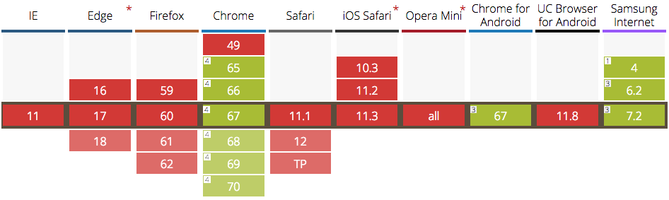

<p class="lead">Over the last decade, we have learned to embrace the uncertainty of developing for the web.</p>

We don't design sites for specific screen dimensions anymore, we make them responsive. We don't assume ideal browsers and devices, we use progressive enhancement. When it comes to connectivity though, we still treat that as a binary choice: you're either on- or offline.

Real connections are not that simple. Depending on your location, network condition or data plan, speeds can range from painfully slow to blazingly fast. The concept of "online" can be a drastically different experience for different users, especially on mobile.

What if there was a way to adapt websites based on our users connections, just like we do for varying display widths and browser capabilities? The [Network Information API](https://wicg.github.io/netinfo/) might enable us to do so.

## The Network Information API

This API is an editor's draft by the <a href="https://wicg.io/" title="Web Incubator Community Group">WICG</a> and currently available in Chrome. It can be accessed through the read-only property `navigator.connection` ([MDN](https://developer.mozilla.org/en-US/docs/Web/API/Navigator/connection)), which exposes several properties that provide information about a user's current connection:

* `connection.type`:

Returns the physical network type of the user agent as strings like "cellular", "ethernet" or "wifi".

* `connection.downlink`:

An effective bandwidth estimate (in Mb/s), based on recently observed active connections.

* `connection.rtt`:

An estimate of the average round-trip time (in milliseconds), based on recently observed active connections.

* `connection.saveData`:

Returns true if the user has requested "reduced data mode" in their browser settings.

* `connection.effectiveType`:

This is a combined estimation of the network quality, based on the round-trip time and downlink properties. It returns a string that describes the connection as either: `slow-2g`, `2g`, `3g` or `4g`. Here's how these categories are determined:

<div class="extend">
    <figure>
        
        <figcaption>Table of the <a href="http://wicg.github.io/netinfo/#dfn-effective-connection-type">effective connection types (ECT)</a></figcaption> 
    </figure>
</div>

### Responding to Changes

There is also an Event Listener available on the `connection` property that fires whenever a change in the network quality is detected:

```js
function onConnectionChange() {
    const { rtt, downlink, effectiveType } = navigator.connection
    console.log(`Round Trip Time: ${rtt}ms`)
    console.log(`Downlink Speed: ${downlink}Mb/s`)
    console.log(`Effective Type: ${effectiveType}`)
}
navigator.connection.addEventListener('change', onConnectionChange)
```

### Support

<a href="https://caniuse.com/#search=Network%20Information%20API">
    
</a>

👉 __Be aware that all of this is still experimental.__ Only Chrome and Samsung Internet browsers have currently implemented the API. It's a very good candidate for progressive enhancement though - and support for other platforms [is on the way](https://docs.google.com/document/d/1LTk9uVMGi4kurzcF5ellsAJReTF31fFJMHrQwSVtBjc/edit).

## Connection-aware components

So how could this be used? Knowing about connection quality enables us to custom-fit resources based on network speed and data preferences. This makes it possible to build an interface that dynamically responds to the user's connection - a "connection-aware" frontend.

By combining the Network Information API with **React**, we could write a component that renders different elements for different speeds. For example, a `<Media />` component in a news article might output:

* __offline__: a placeholder with alt text
* __2g / reduced data mode__: a low-resolution image, ~30kb
* __3g__: a high resolution retina image, ~200kb
* __4g__: a HD video ~1.8MB

<div class="extend">
    <figure>
        
        <figcaption>The different states of our Media component</figcaption> 
    </figure>
</div>

Here's a (very simplified) example of how that might work:

```jsx
class ConnectionAwareMedia extends React.Component (
    constructor(props) {
        super(props)
        this.state = {
            connectionType: undefined
        }
    }

    componentWillMount() {
        // check connection type before first render.
        if (navigator.connection && navigator.connection.effectiveType) {
            const connectionType = navigator.onLine 
                ? navigator.connection.effectiveType
                : 'offline'
            this.setState({
                connectionType
            })
        }
    }

    render() {
        const { connectionType } = this.state
        const { imageSrc, videoSrc, alt } = this.props

        // fallback if network info API is not supported.
        if (!connectionType) {
            return <Image src={imageSrc.hires} alt={alt} />
        }

        // render different subcomponents based on network speed.
        switch(connectionType) {
            case 'offline':
                return <Placeholder caption={alt} />

            case '4g':
                return <Video src={videoSrc} />

            case '3g':
                return <Image src={imageSrc.hires} alt={alt} />

            default:
                return <Image src={imageSrc.lowres} alt={alt} />
        }
    }
)
```

### Using a Higher-Order Component

The above example makes our component a bit unpredictable - it renders different things, even when given the same props. This makes it harder to test and maintain. To simplify it and enable reuse of our logic, moving the network condition check into a separate higher-order component might be a good idea.

Such a <abbr title="Higher Order Component">HoC</abbr> could take in any component we want and make it connection-aware, injecting the effective connection type as a prop.

```jsx
function withConnectionType(WrappedComponent, respondToChange = false) {
    return class extends React.Component {
        constructor(props) {
            super(props)
            this.state = {
                connectionType: undefined
            }
            // Basic API Support Check.
            this.hasNetworkInfoSupport = Boolean(
                navigator.connection && navigator.connection.effectiveType
            )
            this.setConnectionType = this.setConnectionType.bind(this)
        }

        componentWillMount() {
            // Check before the component first renders.
            this.setConnectionType()
        }

        componentDidMount() {
            // optional: respond to connectivity changes.
            if (respondToChange) {
                navigator.connection.addEventListener(
                    'change', 
                    this.setConnectionType
                )
            }
        }

        componentWillUnmount() {
            if (respondToChange) {
                navigator.connection.removeEventListener(
                    'change', 
                    this.setConnectionType
                )
            }
        }

        getConnectionType() {
            const connection = navigator.connection
            // check if we're offline first...
            if (!navigator.onLine) {
                return 'offline'
            }
            // ...or if reduced data is preferred.
            if (connection.saveData) {
                return 'saveData'
            }
            return connection.effectiveType
        }

        setConnectionType() {
            if (this.hasNetworkInfoSupport) {
                const connectionType = this.getConnectionType()
                this.setState({
                    connectionType
                })
            }
        }

        render() {
            // inject the prop into our component.
            // default to "undefined" if API is not supported.
            return (
                <WrappedComponent
                    connectionType={this.state.connectionType}
                    {...this.props}
                />
            )
        }
    }
}

// Now we can reuse the function to enhance all kinds of components.
const ConnectionAwareMedia = withConnectionType(Media)
```

👉  This small proof-of concept is also <a href="https://codepen.io/mxbck/pen/5e897c9cd7c75d130d1f86bc5b87a1d2?editors=0010" target="_blank" rel="noopener noreferrer">available on CodePen</a>, if you want to play around.


I'm running an email list for people interested in modern front-end development!
If you enjoy that kind of stuff, you can join here and I'll notify you whenever I publish a new post. No strings attached, unsubscribe anytime.


## Further Reading

* [Network Information API Draft](https://wicg.github.io/netinfo/) - WICG
* [Dev Thread in Chromium Forum](https://groups.google.com/a/chromium.org/forum/m/#!topic/blink-dev/UVfNMH50aaQ)- Intent to Ship
* [Official Example for Chrome](https://googlechrome.github.io/samples/network-information/index.html) - shows all currently available properties