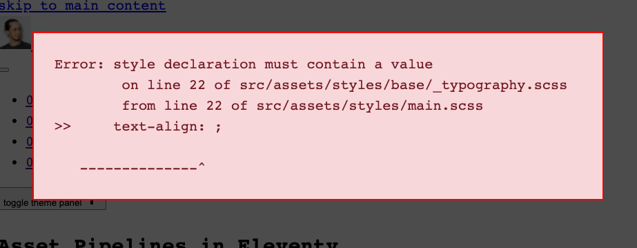

<p class="lead">"Asset Pipeline" is a fancy way of describing a process that compiles CSS, Javascript or other things you want to transform from a bunch of sources to a production-ready output file.</p>

While some static site generators have a standardized way of handling assets, Eleventy does not. That's a good thing - it gives you the flexibility to handle this any way you want, rather than forcing an opinionated way of doing things on you that might not fit your specific needs. 

That flexibility comes at a price though: you need to figure out your preferred setup first. I've tinkered with this a lot, so I wanted to share my learnings here. BTW: My personal setup "Eleventastic" is also [available on Github](https://github.com/maxboeck/eleventastic).

The most common requirement for an asset pipeline is to build CSS and Javascript. That process can have different flavors - maybe you need to compile your stylesheets through Sass or PostCSS? Maybe you want Tailwind? Maybe your scripts are "transpiled" (translated from modern ES6 to the more compatible ES5 syntax) in Babel or bundled by webpack? Or maybe you want to do something entirely different, like build SVG icon sprites or optimize images?

Whatever you want to achieve, it usually involves plugging some tool into your Eleventy workflow. How can we do that? I've looked at several ways to tackle that problem - here are the approaches I found:

## NPM scripts for everything

One solution is to let Eleventy handle *just the SSG part* (producing HTML) and define other processes to take care of your assets outside of it. The most common way to do this is through [npm scripts](https://docs.npmjs.com/cli/v7/using-npm/scripts). If you're not familiar with these, they are essentially shortcuts to run node commands, defined in your projects' `package.json` file.


Some examples using this approach:

* [Hylia](https://github.com/andy-piccalilli/hylia) by Andy Bell
* [11ty-netlify-jumpstart](https://github.com/5t3ph/11ty-netlify-jumpstart) by Stephanie Eckles
* [pack11ty](https://github.com/nhoizey/pack11ty) by Nicolas Hoizey


For example, if you wanted to compile your CSS from a bunch of Sass files, you could set up your NPM scripts like this:

```json
// package.json

"scripts": {
  "watch:sass": "sass --watch _src/sass:_site/assets/styles",
  "build:sass": "sass _src/sass:_site/assets/styles",
  "watch:eleventy": "eleventy --serve",
  "build:eleventy": "eleventy",
  "start": "npm-run-all build:sass --parallel watch:eleventy watch:sass",
  "build": "npm-run-all build:eleventy build:sass"
}
```

The `watch:sass` and `build:sass` scripts both run the Sass compilation command, just with a different configuration depending on your environment.

With utilities like `npm-run-all`, you can even run multiple scripts at once. So one "main command" like `npm start` will run Eleventy and simultaneously start watching your Sass files for changes, and recompile them when they do.

This solution is extremely flexible. There are node tools for __everything__, and there's no limit to what you can do. However depending on how complex your build is, the setup can get a bit unwieldy. If you want to manage multiple asset pipelines that have to run in a specific order with a specific configuration, it's not that easy to keep track of things.

And since each of these scripts is a separate process that runs outside of Eleventy, it has no knowledge about any of them. You can tell Eleventy to watch for changes that these external builds cause, but things can get complex if tasks depend on each other. You can also run into situations where multiple passes are required to achieve the desired output, and since Eleventy can't optimize for processes outside of itself, large pages can take longer to build.

## Manage build tasks with Gulp

Another popular solution is to use [Gulp](https://gulpjs.com/) to manage assets. Although it is not the hottest new tech on the block anymore *(pssst: it's OK to use tools that are older than a week)*, it's still a perfect tool for the job: Gulp takes in a bunch of source files, runs them through any transformations you want and spits out static files at the end. Sounds exactly right!


Some examples using this approach:

* [hawksworx.com](https://github.com/philhawksworth/hawksworx.com) by Phil Hawksworth
* [11ty-base](https://github.com/andy-piccalilli/11ty-base) by Andy Bell
* [Smix Eleventy Starter](https://github.com/hirusi/smix-eleventy-starter) by Ru Singh


Gulp is a node-based task runner lets you define your asset pipelines as functions like this:

```js
// Gulpfile.js

const gulp = require('gulp')
const sass = require('gulp-sass')

// define sass compilation task
gulp.task('styles', function() {
    return gulp
        .src('/main.scss')
        .pipe(
            sass({
                precision: 10,
                outputStyle: 'expanded'
            }).on('error', sass.logError)
        )
        .pipe(gulp.dest('/assets/styles'))
})

// define script bundling task
gulp.task('scripts', ...)

// Run the different tasks in the asset pipeline
gulp.task('assets', gulp.parallel('styles', 'scripts', 'icons', 'whatever'))
```

Then you kick things off from a single npm script like this: 

```json
"scripts": {
    "assets": "gulp:assets",
    "build": "eleventy --serve",
    "start": "npm-run-all --parallel build assets"
}
```

This is more readable and versatile than npm scripts, but really we're doing the same thing under the hood. Gulp runs all the different processes behind the scenes and outputs the finished `.css` or `.js` files into our build folder.  

The drawback here is that it locks you into the Gulp world of doing things. You often need gulp-wrapper packages for popular tools (e.g. `gulp-sass` instead of `node-sass`) to work with the "streaming" nature of it. Plus you're still running external builds, so all of the pitfalls that come with npm scripts still apply.

## One build to rule them all

The underlying issue with both these methods is the same. That's why some Eleventy setups are going a slightly different route: instead of running assets pipelines as external builds, they teach Eleventy itself to handle them. That way, everything runs through a single, integrated process. 


Some examples using this approach:

* [EleventyOne](https://github.com/philhawksworth/eleventyone) by Phil Hawskworth
* [Supermaya](https://github.com/MadeByMike/supermaya) by Mike Riethmuller
* [Eleventastic](https://github.com/maxboeck/eleventastic) by me


Think of your assets as just another static "page" here. Instead of markdown, a template takes Sass or ES6 as input, and instead of generating HTML, it runs it through a tool like `node-sass` or `webpack` and outputs CSS or JS.

By leveraging [Javascript templates](https://www.11ty.dev/docs/languages/javascript/#classes), you can configure Eleventy to process almost any file you want. To use them, add the `11ty.js` extension to the list of recognized input formats in your `.eleventy.js` config file:

```js
// .eleventy.js

module.exports = function (eleventyConfig) {
    // add "11ty.js" to your supported template formats
    return {
        templateFormats: ['njk', 'md', '11ty.js']
    }
}
```

Now you can set up your asset pipeline by making a new template somewhere in your input folder. Let's call it `styles.11ty.js` for example. It could look something like this:

```js
// styles.11ty.js

const path = require('path')
const sass = require('node-sass')

module.exports = class {
    // define meta data for this template,
    // just like you would with front matter in markdown.
    async data() {
        return {
            permalink: '/assets/styles/main.css',
            eleventyExcludeFromCollections: true,
            entryFile: path.join(__dirname, '/main.scss')
        }
    }

    // custom method that runs Sass compilation
    // and returns CSS as a string
    async compileSass(options) {
        return new Promise((resolve, reject) => {
            const callback = (error, result) => {
                if (error) reject(error)
                else resolve(result.css.toString())
            }
            return sass.render(options, callback)
        }
    }

    // this function is mandatory and determines the contents of the
    // generated output file. it gets passed all our "front matter" data.
    async render({ entryFile }) {
        try {
            return await this.compileSass({ file: entryFile })
        } catch (error) {
            throw error
        }
    }
}
```

The `permalink` property here lets us define which file the template generates and where to put it. We can use any type of data as input, then transform it somehow and return it in the `render` method. We've essentially done the same thing as defining a Sass task in Gulp, but this time it's part of the Eleventy build itself!

This gives us even more control over the process. For example - if the compilation fails, we can use that information in the build. We can catch errors in the Sass code and display a message as an overlay in Eleventy's dev server:

<figure class="extend">
    
    <figcaption>Showing a compilation error as a custom code overlay in your local site build</figcaption>
</figure>

Check out the [Eleventastic source](https://github.com/maxboeck/eleventastic/blob/master/src/assets/styles/__styles.11ty.js) to see how to achieve this. (HT to "Supermaya" by Mike Riethmuller for the idea)

A single template can also build multiple files this way. Using Eleventy's `pagination` feature, we can i.e. generate different [Javascript bundles](https://github.com/maxboeck/eleventastic/blob/master/src/assets/scripts/__scripts.11ty.js) from different source files:

```js
// scripts.11ty.js

const ENTRY_POINTS = {
    app: 'app.js',
    comments: 'comments/index.js',
    search: 'search/index.js'
}

module.exports = class {
    // again, the data() function does esentially the same 
    // as defining front matter in a markdown file.
    async data() {
        return {
            // define a custom property "entryPoints" first
            entryPoints: ENTRY_POINTS,

            // then take each of the files in "entryPoints"
            // and process them separately as "bundleName"
            pagination: {
                data: 'entryPoints',
                alias: 'bundleName',
                size: 1
            },

            // for each bundle, output a different Javascript file
            permalink: ({ bundleName }) => `/assets/scripts/${bundleName}.js`,

            // keep the scripts.11ty.js itself out of collections
            eleventyExcludeFromCollections: true
        }
    }

    // a custom helper function that will be called with
    // each separate file the template processes.
    async compileJS(bundleName) {
        const entryPoint = path.join(__dirname, ENTRY_POINTS[bundleName])
        // do compilation stuff inhere like
        // run file through webpack, Babel, etc
        // and return the result as a string

        // --- omitted for brevity ---

        return js
    }

    // output the compiled JS as file contents
    render ({ bundleName }) {
        try {
            return await this.compileJS(bundleName)
        } catch (err) {
            console.log(err)
            return null
        }
    }
}
```

I personally prefer the fully-integrated way of doing things, because it's easier for my brain to think of assets this way. HTML, CSS, JS, SVG: it's all handled the same. However, your personal preference might differ. That's OK - there really is no "right way" of doing this. 

The beauty of unopinionated tools like Eleventy is that you get to choose what fits you best. If it works, it works! 😉