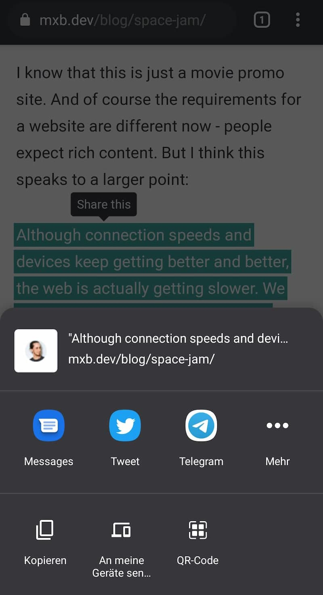
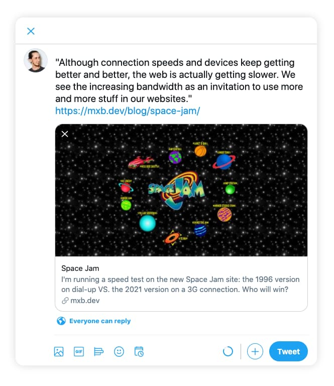

<p class="lead">I took a stab at building a plugin for Eleventy that lets me highlight selected pieces of text and provide users with an easy way to share them.</p>

This feature was first made popular by [Medium](https://medium.com/), where authors can pick a "top highlight" in a post and hovering it will show a tooltip with sharing options. I wanted something like this for independent blogging too, so I came up with a custom solution.

Here's how that looks in action:

Here's some highlighted text you can share! You shouldn't though, this is obviously just a demo. Lorem Ipsum Dolor to you, friend!

## How it works

The base of this feature is a `<mark>` tag wrapped in a custom `<share-highlight>` element.

If the [Web Share API](https://developer.mozilla.org/en-US/docs/Web/API/Navigator/share) is supported (currently in Safari, Edge and Android Chrome), clicking the element will bring up your share options and insert the quoted text and a link to the current page. You can share it on any platform that registers as a share target.

<figure>
    
    <figcaption>Here's how sharing looks in Android Chrome</figcaption>
</figure>

If the API is not supported, the component will fall back to sharing on Twitter via [tweet intent URL](https://developer.twitter.com/en/docs/twitter-for-websites/tweet-button/guides/web-intent). The tooltip will show the Twitter icon and clicking the highlight opens a new tab with a pre-filled tweet:

<figure>
    
    <figcaption>Sharing to Twitter as a Fallback</figcaption>
</figure>

## How to use it

If you want to use this on your own site, follow these steps. (keep in mind that this is an early version though, and there are probably  still some [issues to sort out](#h-accessibility-considerations).)

1. Download the plugin with NPM by running `npm i eleventy-plugin-share-highlight --save` on the command line in your project's root folder (where the package.json file is).
2. Add the plugin to your `.eleventy.js` configuration file:

```js
// .eleventy.js
const pluginShareHighlight = require('eleventy-plugin-share-highlight');

module.exports = function (eleventyConfig) {
    eleventyConfig.addPlugin(pluginShareHighlight, {
        // optional: define the tooltip label.
        // will be "Share this" if omitted.
        label: "Teilen"
    })
}
```

3. This will register the `highlight` shortcode. You can use it in your templates or markdown files like this:

```md
<!-- blogpost.md -->
Here's some highlighted text you can share!
```

This will highlight the containing text in a `<mark>` tag and wrap it in the custom element `<share-highlight>`. So the output HTML will look something like this:

```html
<share-highlight label="Share this">
    <mark>Here's some highlighted text you can share!</mark>
<share-highlight>
```

If Javascript or Custom Elements are not supported, or if your post is displayed e.g. in an RSS reader, the `<mark>` tag will still be valid and give the highlighted text the correct semantics. 

4. To further enhance that with the instant sharing function, you need to add the [custom element definition](https://github.com/maxboeck/eleventy-plugin-share-highlight/blob/main/share-highlight.js) first. Depending on your setup, you can either include that as part of a bundle by importing it directly:

```js
import 'eleventy-plugin-share-highlight/share-highlight'
```

...or [copy the file](https://github.com/maxboeck/eleventy-plugin-share-highlight/blob/main/share-highlight.js) and add it directly to your HTML with something like:

```html
<head>
    <script src="/js/share-highlight.js" async defer></script>
</head>
```

5. To style the highlight, add [this piece of CSS](https://github.com/maxboeck/eleventy-plugin-share-highlight/blob/main/styles.css) and customize it to match your design:

```css
/* general styles for text highlight */
mark {
    background-color: yellow;
}
/* styling if webcomponent is supported */
share-highlight {
    /* default state */
    --share-highlight-text-color: inherit;
    --share-highlight-bg-color: yellow;
    /* hover/focus state */
    --share-highlight-text-color-active: inherit;
    --share-highlight-bg-color-active: orange;
    /* tooltip */
    --share-highlight-tooltip-text-color: white;
    --share-highlight-tooltip-bg-color: black;
}
```

## Accessibility Considerations

This is my first Eleventy plugin and also my first web component. I'm fairly confident that the Eleventy part is sound, but I don't have much experience with web components, and I have some concerns.

My biggest issue with this is accessibility. I want the element to be keyboard-accessible, so I made it focusable and added keyboard listeners to trigger it with the Enter key. The tooltip label also doubles as the `aria-label` property for the component, but I don't quite know how screenreaders handle custom elements with no inherent semantics. 

I guess the cleanest option would be to use an actual `<button>` to trigger the share action, but I also need the element to be inline-level, so the highlighting doesn't break text flow.

If you know your way around webcomponents and have a suggestion on how to improve this thing, please feel free to [submit a PR](https://github.com/maxboeck/eleventy-plugin-share-highlight)!

