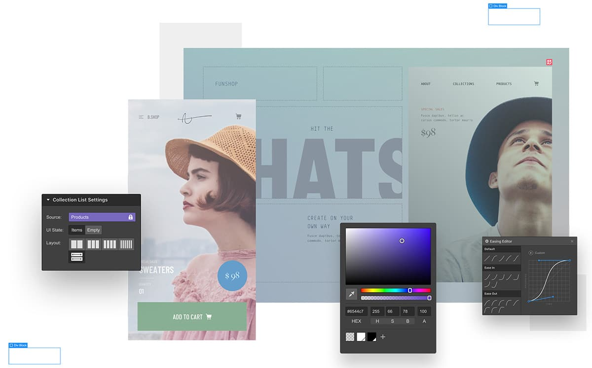

In big cultural concepts like music or fashion, things have a way of coming around full circle.
I'm pretty sure someday grunge will come back as a hot new sample, and at some point our kids might think frosted hair tips are totally cool.

When I look at some of the trends on the web today, I wonder if we're at that point yet. I wonder if we're ready to revisit some of the ideas of the early web again.

Probably not in design - I'm afraid `dancing-baby.gif` is gone for good. But some of the broader ideas from back then are picking up a second wind lately, and I like it.

## Serverside Rendering

After spending the better part of the last decade shifting rendering logic to the client, it looks like the pendulum is about to swing into the other direction again.

With projects like [Phoenix Liveview](https://www.phoenixframework.org/) or [hey.com](https://hey.com/how-it-works/)'s recent "it's-just-HTML" approach, it seems like server-side rendering (SSR) is stepping back into the spotlight. 

<blockquote class="twitter-tweet">
If you think that sounds like the web of 25 years ago, you’re right! Except the HEY front-end stack progressively enhances the “classic web” to work like the “2020 web,” with all the fidelity you’d expect from a well-built SPA.
&mdash; Sam Stephenson (@sstephenson) <a href="https://twitter.com/sstephenson/status/1272608171056680960?ref_src=twsrc%5Etfw">June 15, 2020</a></blockquote>

It makes sense - servers are __really good__ at this, and sending compressed HTML through the network can be lightning fast. The classic request-response cycle has evolved as well: HTTP/2 and smart techniques like [Turbolinks](https://github.com/turbolinks/turbolinks) or [just-in-time preloading](https://instant.page/) allow for a much better experience now than when you first tried to load that Michael Jordan photo on the Space Jam website over dial-up.

Taking the responsibility of rendering UI and all the Javascript that comes with it off users' shoulders would be a great ~~old~~ new strategy for the next generation of web apps.

## No-Code Tools

[Frontpage](https://en.wikipedia.org/wiki/Microsoft_FrontPage) and [Dreamweaver](https://en.wikipedia.org/wiki/Adobe_Dreamweaver) were big in the 90s because of their "What You See Is What You Get" interface. People could set up a website without any coding skills, just by dragging boxes and typing text in them.

Of course they soon found that there was still source code underneath, you just didn't see it. And most of the time, that source code was a big heap of auto-generated garbage - it ultimately failed to keep up with the requirements of the modern web.

<figure class="extend">
    
</figure>

Today our understanding of the web has improved, and so have our tools. [Webflow](https://webflow.com/) is one of the contenders for the "no-code editor" trophy. The output it generates is far better.

These tools will probably not be a replacement for developers as a whole - complex projects still require tons of human brainpower to work. But for all the landing pages and marketing sites, this could be the holy grail of <abbr title="What you see is what you get">WYSIWYG</abbr> we thought we had in the 90s.

## Personal Websites

It might just be my IndieWeb filter bubble talking, but I think there is a renewed interest in personal websites. A lot of big social media giants are falling out of favor, and it becomes cool again to __own a space__ on the web rather than being one of a billion usernames.

Our digital identities are becoming increasingly more important, and people become aware that they're not in control of their data. Personal sites were very popular in the era before Myspace and Facebook, and it's now easier than ever to build one.

Services like [Carrd](https://carrd.co/) offer a straightforward way to create simple one-pagers, and their numbers show a lot of interest:

<blockquote class="twitter-tweet">
Totals for 2019:  🙋 213k new users 🌐 381k new sites 💵 $308k <a href="https://t.co/k3mNeiIyzL">https://t.co/k3mNeiIyzL</a>
&mdash; aj ⚡️ 🍜 (@ajlkn) <a href="https://twitter.com/ajlkn/status/1212418595763998720?ref_src=twsrc%5Etfw">January 1, 2020</a></blockquote>

Blogging is gaining popularity again as well, used as a tool for self-marketing or simply to express opinions. There are lots of good options for people who want to pick up blogging - either on their own sites or with platforms like [micro.blog](http://micro.blog/), that offer more independence than Medium & Co. 


If you're looking to build your own personal site and are interested in things like front-end dev and Eleventy, you can sign up for my personal email list. Get notified whenever I publish something new, unsubscribe anytime.


## Curated Feeds and Discovery

Another issue created by social media is the prevalence of "algorithmic feeds". We decided that the constant stream of input for our eyeballs should never end, so we built these complex systems to generate new content for us based on our interests. 

But these are giant black boxes, and nobody really knows what signals go into them. Throw advertising, "fake news" and a couple of trolls into the mix, and you get the mess we all know now.

That's why many people crave a __more controlled reading experience__ on their own terms. Chronological, personal, relevant - a bespoke magazine of trusted sources. A curated feed.

One way to achieve something like that is through plain ol' boring RSS. One more thing that was said to be dead but is growing in popularity again:

<blockquote class="twitter-tweet">
Who’s gonna read your personal blog because it has an RSS feed? I’m gonna read your personal blog because it has an RSS feed. <a href="https://t.co/mtcyKhEVet">pic.twitter.com/mtcyKhEVet</a>
&mdash; Chris Coyier (@chriscoyier) <a href="https://twitter.com/chriscoyier/status/1214606808125341696?ref_src=twsrc%5Etfw">January 7, 2020</a></blockquote>

Another possibility is to discover new content through human connections instead of algorithms. People we already know for their content recommend others in the same field, creating decentralized clusters of trusted information.

Website owners used to do this a lot in the days before search engines, by providing [Blogroll Pages](/blogroll/) or forming [Webrings](https://en.wikipedia.org/wiki/Webring) with links to others in their cluster.


__Webrings__ were a common way for people to connect their sites in the early web. To be a member of a webring, you had to embed a little widget on your site that contained a “forward”, a “backward”, and a “random” button. These buttons would then link to other sites in the ring.

BTW: If you want to host your own webring, I made this free [Starter Kit](/blog/webring-kit/) for you.


<webring-banner>
    
Member of the <a href="https://webringdemo.netlify.com">An Example Webring</a> webring

    <a href="https://webringdemo.netlify.com/prev">Previous</a>
    <a href="https://webringdemo.netlify.com/random">Random</a>
    <a href="https://webringdemo.netlify.com/next">Next</a>
</webring-banner>

## Smaller Communities and Web Monetization

Many independent creators are moving away from big "everyone's on them" platforms back to private, more niche communities. New models for membership sites like [Ghost's "Members"](https://ghost.org/members/) feature enable creators to build communities on their content. People teach courses, self-publish books or provide APIs for specific topics. 

Where the 90s had chatrooms and message boards, today there are tools like [Discord](https://discord.com/) or [Twitch](https://www.twitch.tv/) that help people with shared interests to connect with each other. These niche communities can then be a powerful userbase for independent businesses.

Of course the problem of monetization has existed from the very start of the web, and it's still not easy today to earn money without splattering ads everywhere. But new standards like the [Web Monetization API](https://webmonetization.org/) could be a very interesting solution, enabling creators to [receive micro-payments](https://coil.com/) for their content. 

## Learning from the Past

I don't know if all of these trends will really play out, or if we're up for something completely different. I do think it's a good idea to learn from the past though, because that is what keeps us moving forward.

So maybe the second 90s can be even better than the first. At least we're done with NSYNC this time.