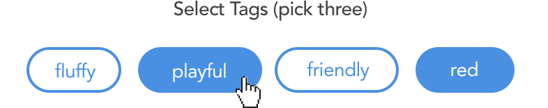

<p class="lead">The React JSX Syntax offers a layer of abstraction that's very useful for component-based systems - but it's easy to forget that everything you write ultimately compiles down to HTML.</p>

Encapsulating pieces of UI this way makes it easier to compose larger systems, but it also hides the "bare bones" structure of an application. That's not a bad thing - but I feel like it's one of the reasons why people learning frontend today can get a distorted understanding of web development.

If you're writing code for a browser, you're writing HTML. That's why it's important to know your semantics, and choose the correct element for the task at hand.

Here are a few tips how that can be done.

## Look past the surface

The most important rule when you're trying to decide which element to use is: don't rely on the visual appearance. Everything can be made to look like anything else. 

Instead, choose elements based on **behaviour** and **meaning**. As a quick check, you can try to disable all CSS in your devtools and take a look at the page in the browser's default style. Does it still make sense?

### Quiz Time

Here's a little quiz: Imagine you're building an App for [we rate dogs™](https://twitter.com/dog_rates) that provides a searchable database of dog pics. What element would you use to build the `<Tag />` component seen here?


In this case, clicking the tags leads you to another page, so they're links. Easy. 

OK, how about now?

<figure>
    
    <figcaption>The component looks the same, but its behaviour is different now.</figcaption>
</figure>

Here, the tags are choices a user can make to select multiple values from a predefined set of options. So the underlying element is actually an `<input type="checkbox">`. The clickable part is the input label, and the actual checkbox is hidden with CSS.

It might be tempting to use the same `<Tag>` component for both situations. Have it render a neutral `<span>` and pass it an `onClick` function via props to handle the different behaviour.
But not only would that strip the component of its semantics, we would miss out on all the things the browser just does for free when we use the correct tag.

## Seize the Props

One of the strenghts of components is their reusability, and the ability to configure them through props. So why not use that to our advantage?

By using the props supplied to our component, we can conditionally decide which HTML element to render. For example a `<Tag href={url} />` could result in a link, while `<Tag value={id} />` might render an input. The visual appearance could be the same in both cases, but the context alters the semantic meaning.

## Use Buttons

Most of the time, the element you're looking for to trigger an arbitrary action is a `<button>`. Whenever you find yourself attaching an `onClick` handler to a `<div>`, think twice. Is that really the best choice? 

The same goes for "empty" links that do not change the URL in some way: If you find something like this in your code:

```jsx
<a href="#" onClick={someFunction}>
``` 
Make it a button instead. 

If the thing you're building isn't supposed to look like a button, again - don't rely on visual appearance here. "Clickable divs" are often only used because they come with no default styles of their own - but removing those from a button can be achieved in 3 lines of CSS.

By the way, it's also perfectly valid for a button to wrap a larger block of content. It is not limited to just text or icons. 

## Mapping Data to JSX

Say our dog rating app has an API. You request some data and it gives you something like this:

```js
[
    {
        id: '216df16ca8b1',
        title: 'Shiba Inu',
        image: '/assets/img/shibainu.jpg',
        description: 'Such shibe, very dog. wow',
        url: '/doggos/shiba-inu'
    },
    {
        id: '5ea3621cf16',
        title: 'Alaskan Malamute',
        image: '/assets/img/malamute.jpg',
        description: 'The Malamutes floof is very sof.',
        url: '/doggos/alaskan-malmute'
    },
    {...}
]
```
Now your job is to transform that data into a card UI.

Most of the time when you want to `map()` an array of items to a JSX structure, the semantically correct way to do it is a **list**. Depending on the type of data, this could be an `<ol>` if the order is important (for example in a comments thread). If not, go with `<ul>`.

Here's a useful pattern:

```jsx
const CardList = ({ items, title }) => (
    <ul className="cardlist" aria-label={title}>
        {items.map(item => (
            <li key={item.id} className="cardlist__item">
                <Card {...item} />
            </li>
        ))}
    </ul>
)

<CardList items={doggos} title="Todays Doggos" />
```

Why is this better than simply returning an array of `<Card />`s?

By making this two dedicated components, you can separate layout from content.
The container could be styled as a list, grid, or a slider - and it can dynamically change columns on different breakpoints. The Card component doesn't have to care about its context. It can just be dropped into any wrapper and adopt its width.

Screenreaders will announce this as "Todays doggos, list, 5 items" or similar.

## Fight the Divs

As of React v16, you can use `<React.Fragment>` (or the shorthand `<>...</>` if you feel like a 1337 hacker). This lets you return multiple sibling DOM nodes without having to wrap them in an unnecessary div. The Fragment does not render to anything tangible in HTML, and you don't have to pass unique `key` properties to the elements it contains. 

It's awesome - use it.

```jsx
return (
    <React.Fragment>
        <h1>Multiple Siblings without a wrapper!</h1>
        <MyComponent />
    </React.Fragment>
)
```

## Further Resources

* [HTML5 Semantics](http://html5doctor.com/lets-talk-about-semantics/)
* [Eslint Plugin JSX A11y](https://www.npmjs.com/package/eslint-plugin-jsx-a11y)
* [Semantic UI Library](https://react.semantic-ui.com/introduction)