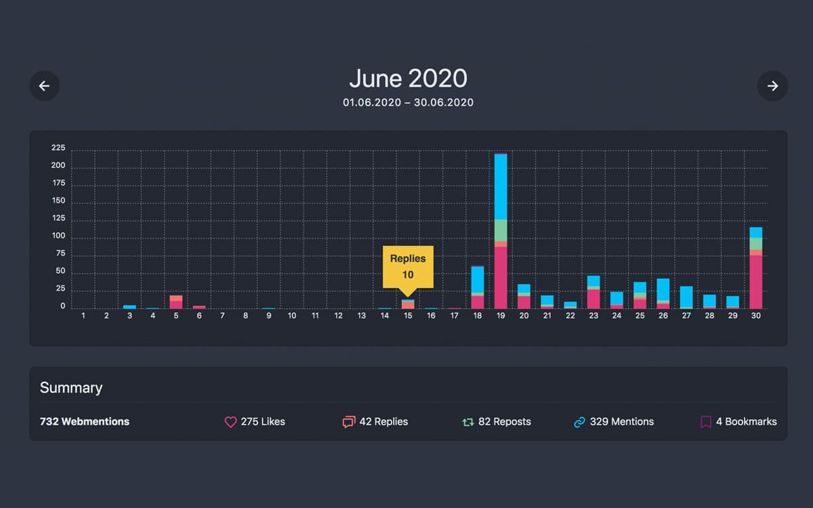
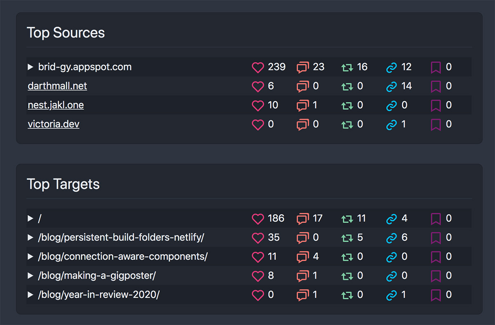
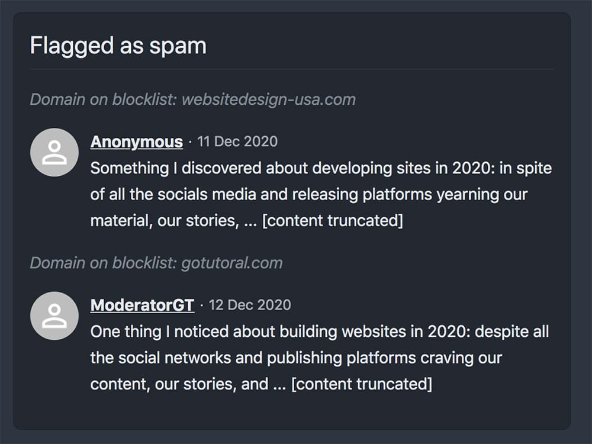

I'm a fan of webmentions. I've written about <a href="/blog/using-webmentions-on-static-sites/">how to use them</a> before, and I'm quite happy with having them on my site.

However, it can get difficult to see what's going on with them - especially if there's a lot of "background noise". Many sites just scrape content from well-known blogs and republish it for SEO juice. If that content includes a link to your site, it can lead to webmention spam.

Unlike on social media, you also don't get notifications or reports about incoming webmentions. You're just handed a bunch of raw data to use however you like. That's part of the beauty of the Indieweb though: you can tailor it to whatever suits you best.

I recently started playing around with the data I get from webmention.io to see if it could be displayed in a more meaningful way. The result is a new side project I call: 

✨✨✨ __Webmention Analytics__ ✨✨✨  
You can see it in action in [this demo](https://analytics.mxb.dev) on my site.

<figure class="extend">
    
    <figcaption>Breakdown of webmentions per day</figcaption>
</figure>

I built this with [Eleventy](https://11ty.dev) and [Netlify](https://netlify.com), mainly because that's my favorite tech stack to tinker with. But for analytics that don't have to be real-time, static site generators are actually a really good fit. 

Expensive computations like parsing and analyzing 8000+ data points like this can be run once a day through a periodic build hook. The reports it generates are then instantly available to the user, while still being up-to-date enough.

## Features

* group webmention data by month
* overview of webmentions by type (like, reply, repost, mention, bookmark...) and day
* show top source URLs sending webmentions to your site
* show top target URLs on your site receiving webmentions
* show top tweets generating webmentions through brid.gy
* check incoming webmentions against a blocklist of known "content scrapers" and spam domains
* automatic daily updates with cron job

<figure class="extend">
    
    <figcaption>Top sources and targets</figcaption>
</figure>

<figure>
    
    <figcaption>Webmentions flagged as spam</figcaption>
</figure>

## Get your own instance!

If you also use webmention.io to show webmentions on your site, you can [fork the code on Github](https://github.com/maxboeck/webmention-analytics) and make your own instance of `webmention-analytics`. Just follow the [instructions](https://github.com/maxboeck/webmention-analytics#get-your-own-instance) in the README to get started.


Keep in mind that this is still a very early version of a weekend side project, so there's probably a few things to iron out. Cheers!


