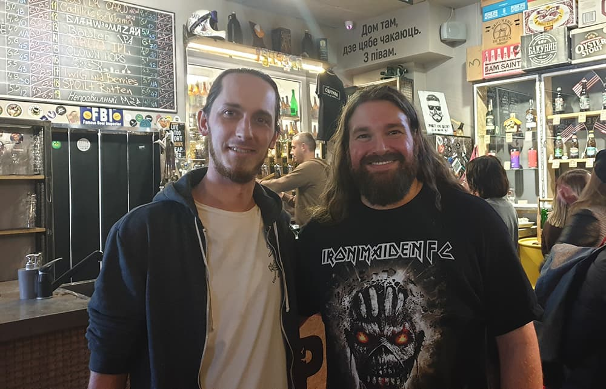
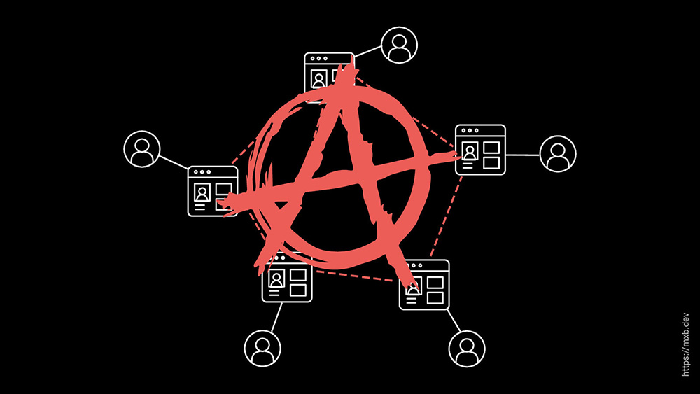
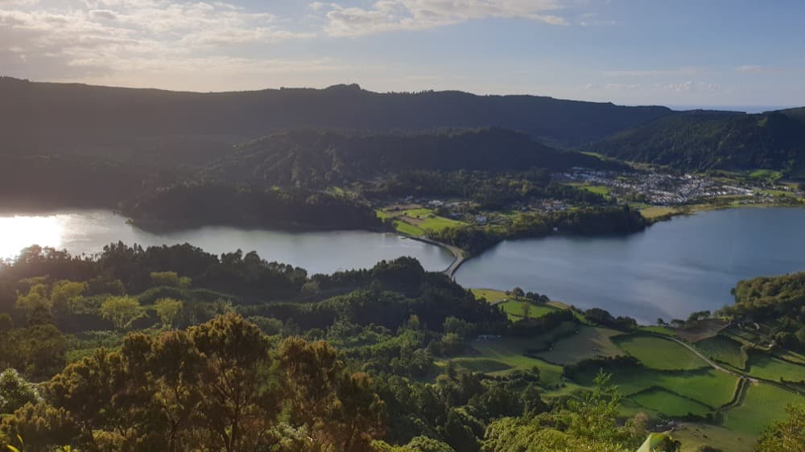

As the final hours of 2019 are winding down, I want to take a moment and look back at everything that happened this year - because it was a busy one.

## Work

At the beginning of 2019, I became a partner at [Codista](https://www.codista.com/), the software studio where I've been working for some time now. Thomas, Luis and I now run the company as a trio, and building together has been great. 

Besides working as a frontend developer on a number of challenging projects this year, I was also responsible for the rebranding of our own identity. There are some interesting new ideas in the works for our studio in 2020, and I'm excited to see them come to life.

## Writing

Counting this one, I've written ten new posts in 2019. That's more than last year, but I'd still like to increase that number.

The most popular posts were: 

* [The CSS Mindset](/blog/the-css-mindset/): a collection of helpful mental models for writing CSS,
* [On Simplicity](/blog/on-simplicity/): how sometimes "less is more" in tech, and 
* [Static Indieweb pt2: Using Webmentions](/blog/using-webmentions-on-static-sites/): a rundown of how to implement webmentions with Eleventy. 

The feedback from the web community on these posts was amazing, and it never gets old to hear that anything you've made actually helped people in some way.

Like in 2018, all my writing was published on my own website. I'm increasingly fond of the IndieWeb and the principles behind it, and I want to continue striving for more independence. Eleventy and Netlify both have been very valuable improvements for my personal site this year, and I really like working with them. 

## Speaking

I wrote two new talks in 2019 and had the chance to speak at a few community events.

First I was invited as a guest speaker to the [Mozilla Developer Roadshow](https://mozilla-tito-devr.netlify.com/), where I had a really interesting "Fireside Chat" about CSS with HJ Chen. It was awesome meeting her and I'm very grateful for the opportunity to speak there.

Following my blog post about the topic, I gave a talk on [the CSS Mindset](https://www.youtube.com/watch?v=1TsFOfBB4GA) at CSS-Minsk-JS in September and had a wonderful time. A big thank you to the organizers and attendees, who made me feel very much at home in Minsk.

<figure>
    
  <figcaption>I met <a href="https://twitter.com/IanPouncey">Ian Pouncey</a> at CSS-Minsk-JS</figcaption>
</figure>

<figure>
    
  <figcaption>One of the slides in my <a href="https://noti.st/mxb/lhMFMv/rage-against-the-content-machine">IndieWeb talk</a></figcaption>
</figure>

A big part of this year was devoted to making our own [Webclerks Conference](https://webclerks.at/) happen in Vienna. It was the first time for me to be involved in the organization of such an event and I really had no idea how it would turn out, so I'm overjoyed that it went so well. 

I also shared my experiences with the IndieWeb in a talk called ["Rage against the Content Machine"](https://youtu.be/ucLEMETfrTA?t=7282) there. I'd love to do that one again in the new year.

## Traveling

I've been fortunate enough to see many beautiful places on this planet now. I made a [little map](/traveling) to keep track of them here.

This year, I visited Portugal, Georgia, Belarus, the Czech Republic and the Azores. My personal favourites were the ancient city of Tbilisi and the raw nature of São Miguel island, both fascinating places in their own regard.

<figure>
    
  <figcaption>Tbilisi, Georgia</figcaption>
</figure>

<figure>
    
  <figcaption>Sete Cidades, São Miguel, Azores</figcaption>
</figure>

## Personal

2019 was also a source of frustration in many ways. From the ongoing global shift to right-wing populism to increasingly dystopian technology trends to the looming threat of climate change. I've had some issues with worrying and stress in my personal life as well. 

But I'd like to think that the new decade can be an opportunity to learn from past mistakes and change things for the better. I'm going to try and focus on that going forward.

## Goals for 2020

* help to further grow Codista into a sustainable, ethical business
* write more regularly
* continue involvement in the IndieWeb community
* attend and speak at more conferences
* make more music 
* read more non-tech books
* keep up with friends and enjoy life a little more

That's all folks. See you tomorrow!