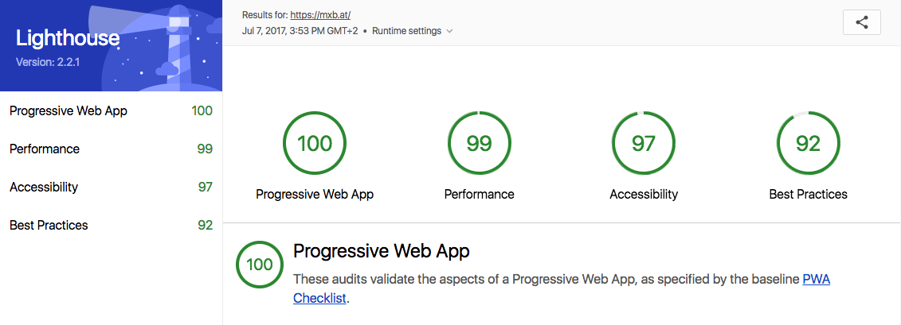

<p class="lead">A Progressive Web App, or PWA, uses modern web capabilities to deliver an app-like user experience. Any website can be a PWA - here's how to do it.</p>

<figure style="text-align:center">
  
  <figcaption>The "add to homescreen" prompt in a PWA</figcaption>    
</figure>

Turning a basic website into a PWA is not that hard and has a lot of real benefits, so I want to take a look at the three main steps necessary to achieve just that.

But first, let me address some common misconceptions:

**1) Your thing does not have to be an "Application" to be a PWA.**<br>
A Progressive Web App can easily be a blog, a marketing site, a shop or a collection of cat memes. At its core, a PWA is just a way to optimize your code for better, faster delivery. You can -and should- take advantage of these new possibilites, regardless of your content.

*Side note: the term "Application" in PWA is [heavily debated](https://adactio.com/journal/12461), since some people feel it communicates the wrong idea. IMHO, its just a name - and these days it's hard to define the difference between websites and "web apps" anyway.* 

**2) Your thing does not have to be a Javascript-powered single page app.**<br>
Again, if you're not running a cutting edge React-Redux <abbr title="Single Page Application">SPA</abbr>, that's no reason to shy away from using this technology. My own site is just a [bunch of static HTML](https://github.com/maxboeck/mxb) based on Jekyll, and it's still a perfectly valid Progressive Web App. If you run something on the web, it can benefit.

**3) PWAs are not specifically made for Google or Android.**<br>
The beauty of it is that PWAs offer the best of both worlds - deep linking and URLs from the www, offline access, push notifications and more from native apps - while still staying completely platform-independent. No app stores, no separate iOS / Android codebases, just the web.

**4) PWAs are ready and safe to use today.**<br>
Jup, the "P" stands for progressive, meaning everything about it can be viewed as an extra layer of enhancement. If an older browser does not support it, it will not break; it just falls back to the default: a regular website.

## OK, So why should I do this?

Turning your website into a PWA offers some serious advantages:

* A faster, more secure user experience
* A better Google ranking
* Better usability
* Better performance
* Offline access

Even if you don't expect your users to "install" your PWA (e.g. place a shortcut on their home screen),
there is still a lot to be gained by making the switch. In fact, all of the steps necessary to make a PWA will actively improve your website and are widely considered best practice.

## Step 1: The Manifest.

A *manifest* is just a JSON file that describes all the meta data of your PWA. Things like the name, language and icon of your app go in there. This information will tell browsers how to display your app when it's saved as a shortcut. It looks something like this:

```json
{
  "lang": "en",
  "dir": "ltr",
  "name": "This is my awesome PWA",
  "short_name": "myPWA",
  "icons": [
    {
      "src": "\/assets\/images\/touch\/android-chrome-192x192.png",
      "sizes": "192x192",
      "type": "image\/png"
    }
  ],
  "theme_color": "#1a1a1a",
  "background_color": "#1a1a1a",
  "start_url": "/",
  "display": "standalone",
  "orientation": "natural"
}
``` 
This is usually called "manifest.json", and linked to from the `<head>` of your site:
```html
<link rel="manifest" href="manifest.json">
```

🔥 Hot Tip: You don't have to write that file yourself. There are different icon sizes for different systems, and getting everything right can be tedious. Instead, just make one 500x500 image of your app icon (probably your logo), and head over to [Real Favicon Generator](http://realfavicongenerator.net/).
They render all common sizes, provide meta tags and generate a manifest file for you. It's awesome.

## Step 2: Go HTTPS.

Progressive Web Apps need to be served over a secure connection, so the **HTTPS protocol** is the way to go. HTTPS encrypts the data users send to your server and prevents intruders from tampering with their connection. As of recently, Google also heavily favors sites on HTTPS and ranks them higher than non-secure competitors.

To switch to HTTPS, you will need an SSL certificate from a trusted authority. How to get them depends on your hosting situation, but generally there are two common ways to do it:

👉 If you operate **your own server** or have root access to one, check out [LetsEncrypt](https://letsencrypt.org/). It's a free, open and straightforward certificate authority that allows anyone to start using HTTPS. It's quite easy to set up and is just as trusted as other authorities.

👉 If you're on **shared hosting**, a lot of providers unfortunately won't allow you the level of control you need to use LetsEncrypt. Instead, they usually offer SSL certificates for a monthly or annual fee. If you're unsure how to get a cert, contact your hosting provider.

After you obtained a certificate, there might be some adjustments you need to make to your code so that all resources are fetched on a secure line. For more information about the process, read [this detailed guide from keyCDN](https://www.keycdn.com/blog/http-to-https/) or check out [Chris Coyier's article](https://css-tricks.com/moving-to-https-on-wordpress/) if you want to migrate a WordPress site.

If everything goes as planned, you'll be rewarded with a nice green lock icon next to your URL:


## Step 3: The Service Worker.

This is where the magic happens. A Service Worker is essentially a piece of Javascript that acts as a middleman between browser and host. It automatically installs itself in supported browsers, can intercept requests made to your site, and respond to them in different ways.

You can set up a new SW by simply creating a Javascript file at the root directory of your project. Let's call it `sw.js`. The contents of that file depend on what you want to achieve - we'll get to that in a second.

To let the browser know we intend to use this file as a Service Worker, we need to register it first. In your site's main script, include a function like this: 

```js
function registerServiceWorker() {
  // register sw script in supporting browsers
  if ('serviceWorker' in navigator) {
    navigator.serviceWorker.register('sw.js', { scope: '/' }).then(() => {
      console.log('Service Worker registered successfully.');
    }).catch(error => {
      console.log('Service Worker registration failed:', error);
    });
  }
}
```
The `scope` parameter defines which requests the SW should be able to intercept. It's a relative path to the domain root. For example, if you were to set this to `/articles`, you could control requests to `yourdomain.com/articles/my-post` but not to `yourdomain.com/contact`.

### Offline is the new black

There is a number of cool things you can do with Service Workers. One of them is the ability to cache your content, store it locally, and thus make it available when the user is offline. Even if they are online, this will have a huge impact on page loading time, since requests can just bypass the network completely and assets are instantly available.

Other than with traditional browser caching, you can define a list of resources to cache when the worker is installed - so a user does not have to navigate to a page first for it to be cached. Here's how that might look:

```js
// sw.js
self.addEventListener('install', e => {
 e.waitUntil(
   // after the service worker is installed,
   // open a new cache
   caches.open('my-pwa-cache').then(cache => {
     // add all URLs of resources we want to cache
     return cache.addAll([
       '/',
       '/index.html',
       '/about.html',
       '/images/doggo.jpg',
       '/styles/main.min.css',
       '/scripts/main.min.js',
     ]);
   })
 );
});
```

🔥 Hot Tip: If you want to get started with offline-first quickly, I'd highly recommend using [sw-precache](https://github.com/GoogleChrome/sw-precache). This is a tool made by the folks at Google that integrates with your existing Gulp or Grunt build process to **generate the service worker file for you.**

You can simply pass it a list of files and it will automatically track all changes, and keep your Service Worker cache up to date. Because `sw-precache` integrates into your site’s build process, you can use wildcards to precache *all* of the resources that match a specific pattern, like so:

```js
import gulp from 'gulp';
import path from 'path';
import swPrecache from 'sw-precache';

const rootDir = '/';

gulp.task('generate-service-worker', callback => {
  swPrecache.write(path.join(rootDir, 'sw.js'), {
    staticFileGlobs: [
      // track and cache all files that match this pattern
      rootDir + '/**/*.{js,html,css,png,jpg,gif}',
    ],
    stripPrefix: rootDir
  }, callback);
});
```

Run this task in your build, and you'll never have to worry about cache invalidation again! 
For smaller, mostly static sites, you can have it precache every image, HTML, JavaScript, and CSS file. For sites with lots of dynamic content, or many large images that aren’t always needed, precaching a “skeleton” subset of your site often makes the most sense.

*PS: For a deeper look into the subject of offline support, be sure to check out ["The Offline Cookbook"](https://jakearchibald.com/2014/offline-cookbook/) by Jake Archibald.*

## Testing your PWA

The Chrome [Lighthouse Extension](https://chrome.google.com/webstore/detail/lighthouse/blipmdconlkpinefehnmjammfjpmpbjk) is a testing tool to check Progressive Web Apps for their Performance, Accessibility and compliance with the PWA spec.

It tests your site in different viewports and network speeds, measures time to first paint and other performance factors, and gives valueable advice for areas that still need improvement. It's a really good benchmark for websites in general.

<figure class="extend">
  
  <figcaption>Lighthouse report for mxb.at</figcaption>
</figure>

You can either install the Lighthouse extension in the [Chrome Web Store](https://chrome.google.com/webstore/detail/lighthouse/blipmdconlkpinefehnmjammfjpmpbjk) or use Chrome Canary, where it is included in the Devtools' Audit tab by default.

### Further Reading

Hopefully that gave you a quick overview on how to get started with PWAs. If you want to dive deeper, here are some good places to learn more:

* Google Developers: [Your First Progressive Web App](https://developers.google.com/web/fundamentals/getting-started/codelabs/your-first-pwapp/)
* Smashing Magazine: [A beginner's guide to PWAs](https://www.smashingmagazine.com/2016/08/a-beginners-guide-to-progressive-web-apps/)
* Free Udacity Course: [Intro to Progressive Web Apps](https://www.udacity.com/course/intro-to-progressive-web-apps--ud811)