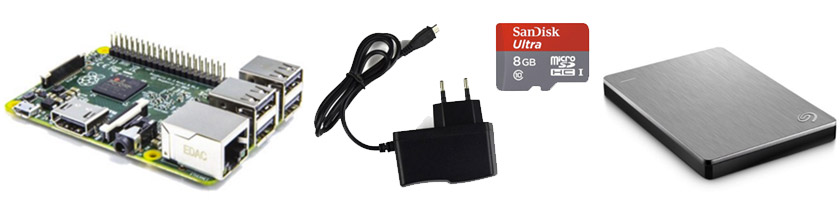

<p class="lead">For the past years, I had all my work files sync between my machines using Dropbox.</p>

This kept me up to date whenever I decided to work from the road, and it acted as an extra backup for non-sensitive data. I bought a Dropbox Pro Account (1TB) and set up my environment in a way that all my project files and databases would be symlinked to the Dropbox Folder.

I only ever edited files on one machine at a time, so merge conflicts were not really an issue. But things get messy once you introduce version control and npm to the workflow. Each project then has `.git` and `node_modules` folders, containing thousands of files and subdirectories that Dropbox tries to keep in sync. That's error-prone, wastes cloud space and defies the purpose of having local packages. Plus it takes forever to sync all node modules to a new machine, when I could simply do `npm install` and be done with it in seconds.

The main problem I had with this was Dropbox' lack of an "ignore" feature. Although [users have been asking about this](https://www.dropboxforum.com/hc/en-us/community/posts/201529949-Why-won-t-Dropbox-add-a-gitignore-like-feature-) for years, there simply is no easy way to selectively exclude files from syncing in your Dropbox. I always wanted something like a `.gitignore` file you could just place in there:

```
# ignore git, npm packages and local stuff
**/.git
**/node_modules
...etc
```

Unfortunately, there's just no way to do this with Dropbox. I tried a lot of approaches to solve this, looked at other cloud storage providers (MEGA, Seafile ...) but none lived up to my expectations. Finally, something caught my interest:

## Torrents to the Rescue!

<a href="https://www.getsync.com/">BitTorrent Sync</a> is an app that synchronizes machines directly (without going the cloud route) using the torrent protocol. It works by sharing "secrets" to access folders and keep them in sync. It's free, stable, and lightning fast. Especially when it comes to large files, like a gigabyte .psd, no cloud service could even come close to this performance.

Most importantly: you can define an `IgnoreList` file to <a href="http://sync-help.bittorrent.com/customer/portal/articles/1673122-ignoring-files-in-sync-ignorelist-">exclude files from syncing</a>. It worked like a charm right out of the box. 

__There's just one catch:__ without the cloud in between, both machines have to be online for the sync to happen. This was a deal-breaker for me, since I needed to be able to shut down my workstation at night, go home, and still have everything up-to-date on my laptop.

Damn, so close. 😭

To get around this limitation, you need something to replace the missing cloud. An always-on server that acts as a middleman between the machines and keeps track of all file changes while they're offline. Here's where it gets (a little) tricky.

## Building your own network-attached storage (NAS)
I didn't want to rent a full-featured server for this because it seemed like overkill. Also, I never really felt good about putting my data into someone else's hands. I wanted to keep things local.

As a low cost alternative, I decided to just build the thing myself. I purchased a <a href="http://www.amazon.de/gp/product/B00T2U7R7I">new Raspberry Pi</a>, an <a href="http://www.amazon.de/gp/product/B00MWXUKDK">SD card</a> and a matching <a href="http://www.amazon.de/gp/product/B00TQSYC92">power supply</a> off Amazon and got to work. I already had an external backup drive to work with, so the whole project set me back about €65 (an annual Dropbox Pro subscription is €99) and took about a day to make.

<figure class="extend">
  
  <figcaption>The "Screw it I'll do it myself" Kit&trade;</figcaption>
</figure>

The pi is small, stable, and consumes very little power. It's ideal as an always-on machine to just plug in and forget about. Plus, you could easily hook it up at a friend's place to have an up-to-date offsite backup!

There's a few <a href="http://blog.bittorrent.com/2013/05/23/how-i-created-my-own-personal-cloud-using-bittorrent-sync-owncloud-and-raspberry-pi/">good tutorials</a> on how to do this, but here's the quick summary:

<ul>
  <li>Set up the pi with <a href="https://www.raspberrypi.org/downloads/raspbian/">Raspbian</a>, a popular debian fork</li>
  <li>Enable SSH access and give it a static IP in your network</li>
  <li>Hook up an external Disk (with separate power supply!), <a href="http://devtidbits.com/2013/03/21/using-usb-external-hard-disk-flash-drives-with-to-your-raspberry-pi/">format and set permissions</a></li>
  <li>Download the BTSync ARM build from their website and configure its web interface</li>
  <li>Register it to automatically <a href="http://blog.meinside.pe.kr/How-to-run-BitTorrent-Sync-as-service-on-Raspberry-Pi/">run as a service</a> on boot</li>
  <li>Set up the folders you want to synchronize</li>
  <li>Brag about it to other nerds on <a href="https://twitter.com/mxbck/status/689089706391408641">twitter</a>.</li>
</ul>