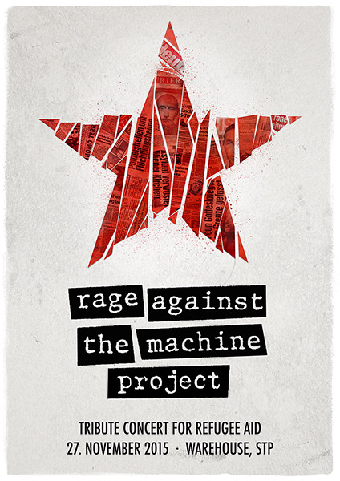
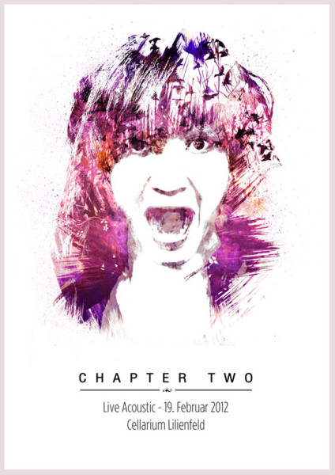
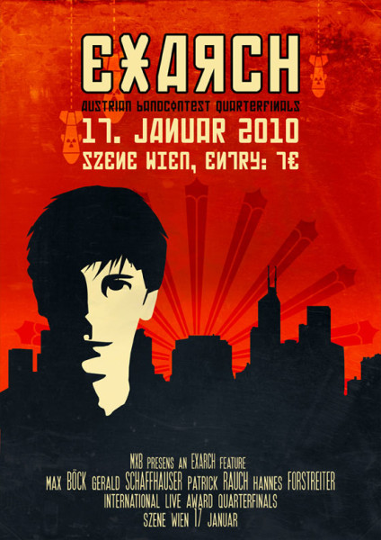

I'm a big fan of good looking band art. Sadly though, unlike other countries, Austria doesn't really have a culture of well designed concert posters - they're usually just bold type on bright neon paper stapled to a signpost. So for a long time, collecting and designing covers and gig posters for local bands has been one of my favourite hobbies. I just love when music and design come together like this.

There are some very talented people out there dedicated to poster art. Some of my personal heroes, for example, include [DKNG Studios](http://www.dkngstudios.com/work/gig-posters/), [Olly Moss](http://ollymoss.com), [Kevin Tong](http://tragicsunshine.com/band_posters/) and [Ron Guyatt](http://www.ronguyatt.com/). Go check em out if you have time, they're all brilliant.

Here are a few of my own works that I made over the years:

    <ul class="scrollpane__content">
        <li class="scrollpane__item">
          
        </li>
        <li class="scrollpane__item">
          
        </li>
        <li class="scrollpane__item">
          
        </li>
        <li class="scrollpane__item">
          
        </li>
        <li class="scrollpane__item">
          
        </li>
        <li class="scrollpane__item">
          
        </li>
        <li class="scrollpane__item">
          
        </li>
        <li class="scrollpane__item">
          
        </li>
        <li class="scrollpane__item">
          
        </li>
        <li class="scrollpane__item">
          
        </li>
        <li class="scrollpane__item">
          
        </li>
        <li class="scrollpane__item">
          
        </li>
    </ul>

