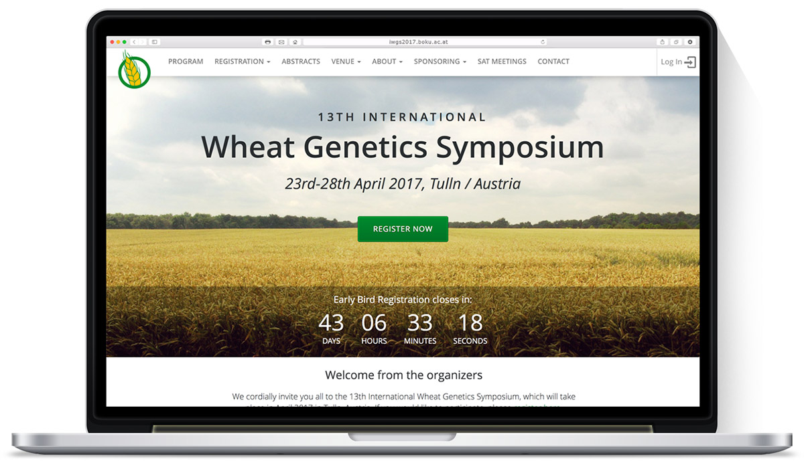
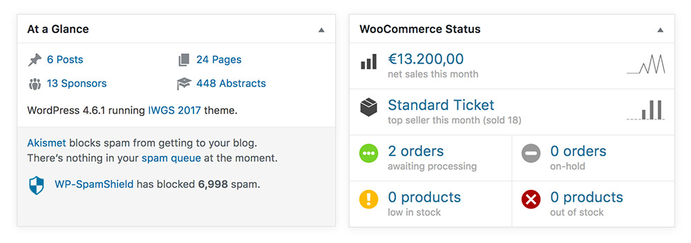
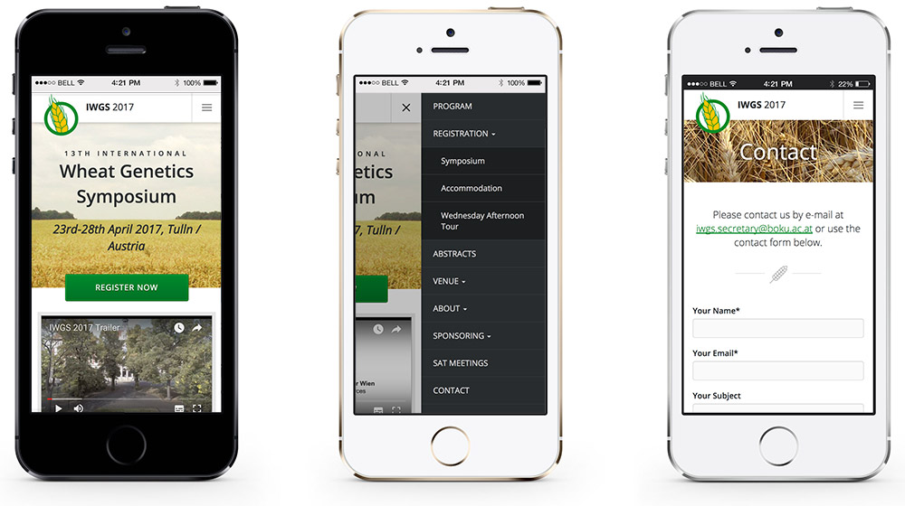

<figure class="extend">
  
</figure>

The _International Wheat Genetics Symposium_ is a conference of the world's leading experts in the field of crop science. Scientists from all around the globe come together every five years to discuss the current state of wheat genetics.

In 2017, the University of Natural Resources and Life Sciences Vienna (<abbr title="Universität für Bodenkultur" lang="de">BOKU</abbr>) was chosen to host the symposium. Having worked on other projects with the University in the past, they approached me to develop the website.

## Objective

Prior to the actual conference, there was a series of tasks the website needed to handle. 
The main functions at this stage were:

* Registration of participants (Ticket Sales)
* Creating a centralized database of scientific abstracts (to later build the program)
* Attract and display sponsors

The site features a WooCommerce ticket shop that was customized to include additional participant information and uses a special payment gateway to handle transactions to the University.

An online abstract system was put in place where potential conference attendees can submit their proposal for a panel in a standardized way. These submissions can then be reviewed by assigned experts in a particular topic, and authors automatically get notified of acceptance or rejection.

All the information is gathered in one place, so after the final selection is made, it's a lot easier to put together a program and printed book of abstracts.

<figure class="extend">
  
</figure>

## Flexible and Resilient

Since the site was going to be used on a broad variety of devices and network conditions, it was especially developed with performance and flexibility in mind. A progressive enhancement approach was used to ensure the highest possible compatibility.

The final result was very well received by both the University organizing committee and the international science community.

<figure class="extend">
  
</figure>