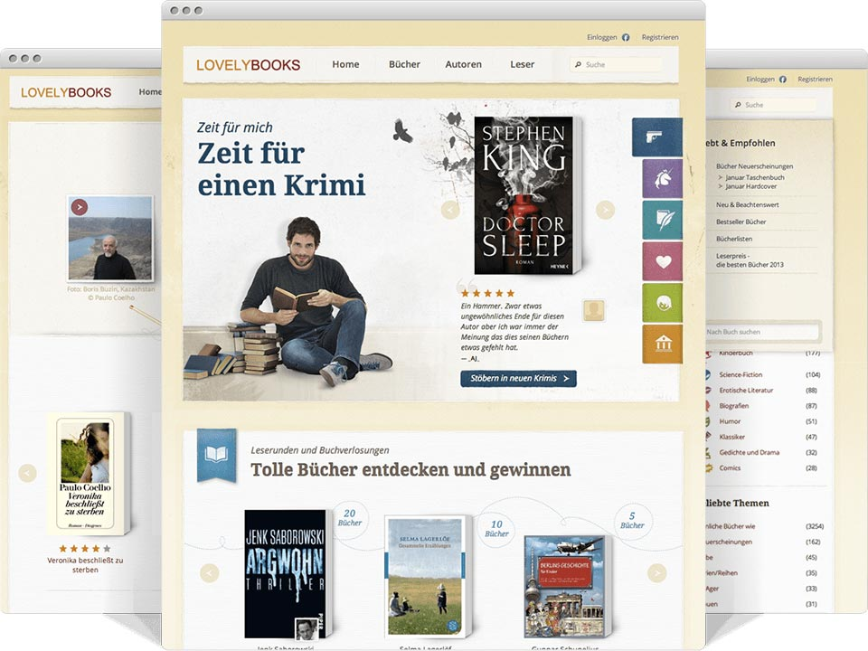
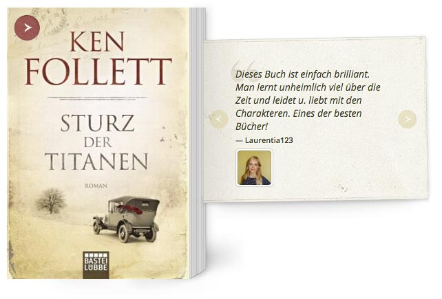

<figure class="extend">
  
</figure>

Lovely Books is the biggest social network for reading in Austria, Germany and Switzerland. It works with about 200 publishers and more than 3000 writers and connects book lovers everywhere. 

People can discover new works in their favorite genre, get in touch with authors they like, or discuss their current books with each other. When the site had a major relaunch in 2012, I was part of the team working on the frontend.

<figure>
  
</figure>