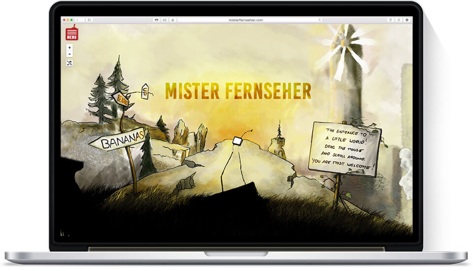
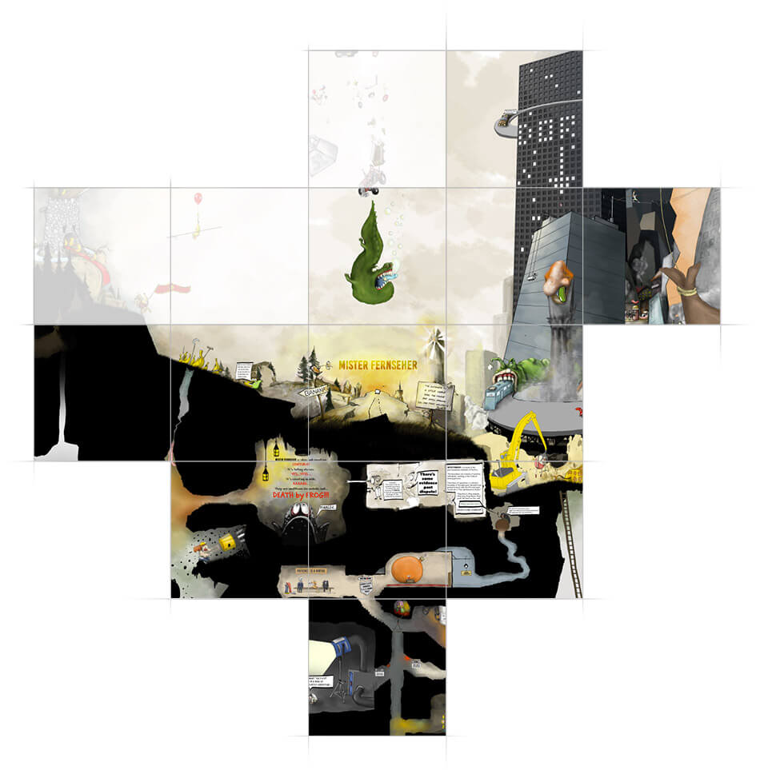
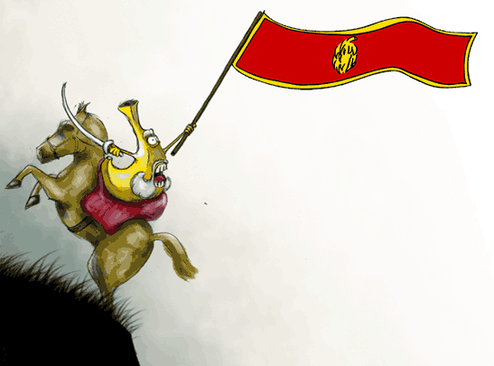
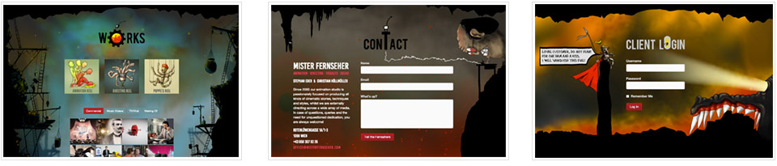

<figure class="extend">
  
</figure>

Mister Fernseher is a two-person production studio in Vienna, run by Stephan Eder and Christian Höllmüller. They work in animation, directing, visual FX and sound design for a wide range of clients, including Manner, T-Mobile, Parship and others. [(check out their work here)](http://misterfernseher.com/works).

In 2015, their old flash-based site was in need of an overhaul, so we teamed up to create something new. The guys from Fernseher, experienced with graphics and sound, handled art direction and screen design, while I took care of the technical development.

## The crazy world of Mister Fernseher

Inspired, among other things, by [Scott McCloud’s “Infinite Canvas”](http://scottmccloud.com/4-inventions/canvas/index.html) comics, we wanted the new site to be something that goes beyond the screen and invites the user to explore. We decided to make the centerpiece of the new website an interactive map of a whole little world, populated by a myriad of quirky places and characters.

Christian began the collossal task of drawing a giant (32.000 x 32.0000 px!) map by hand, gradually filling it with more and more bananas details as the project went on. Using [Leaflet](http://leafletjs.com/), I then transformed this huge image into a zoomable map, basically made up of thousands of separate square pieces (tiles) stitched together. – Much like Google does it with Google Maps.

<figure class="extend">
  
  <figcaption>The pieces of the puzzle.</figcaption>
</figure>

The whole thing is brought to life by adding animation and sound to characters all over the Fernseher world. Animated gifs are placed strategically on the map, while making sure they maintain size and position when the viewport is zoomed or dragged around. Take for example this guy, called “Bananimo”, bravely leading his mob-army of bananas into battle:

<figure style="text-align:left">
  
</figure>

If enabled, matching sounds are triggered when a user hovers over this character – a behaviour that proved to work nicely with the standard click-and-drag exploring of the map. All in all there’s over 50 sounds embedded this way.

## The caves down below

Aside from the front-page map, there’s a works section featuring a video portfolio (externally hosted on vimeo), a straightforward contact page, and a specialized client area. The sub-pages are laid out as “caves” below the main world. There’s some animation going on in there, too – stuff like the page titles, which are embedded as HTML5 canvas-powered [Swiffy animations](https://developers.google.com/swiffy/) (now discontinued by Google).

<figure class="extend">
  
  <figcaption>Adventures below the surface</figcaption>
</figure>

The whole site is 100% flash free and fully responsive, so all content is accessible on mobile devices as well.

## Performance: Making it all work

The site is quite image-heavy and requires a lot of assets to be loaded, so performance optimization was key in delivering a pleasant user experience. Some effort was taken to reduce the number of requests by image spriting, leveraging browser caches, and asynchronously loading some resources (like vimeo thumbnails or JSON for the Swiffy animations).

Getting the map to run snappy, however, required a more complicated approach. Tile servers usually run on better hardware, and there’s a lot of images loaded in while a user is exploring the map. I used the excellent [Varnish Cache](https://www.varnish-cache.org/) to add an extra reverse-proxy on the server side, which really speeds things up.

I also split the tile server across three subdomains to allow for more parallel requests, and made sure that pure-black tiles (there’s quite a few of those) were only requested once. As for the map sounds, they are only loaded in when triggered, and then streamed to instantly start playing.

The combined techniques together make for a somewhat smooth experience, and resulted in pretty good scores for a site this size.