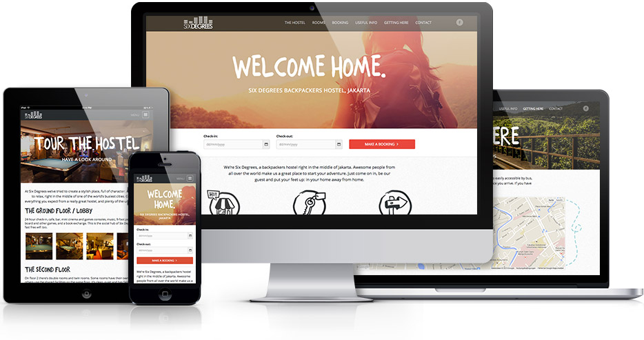
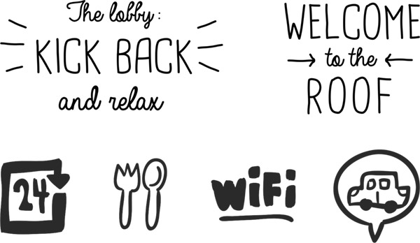
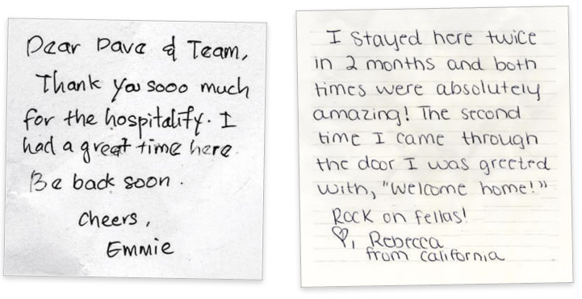
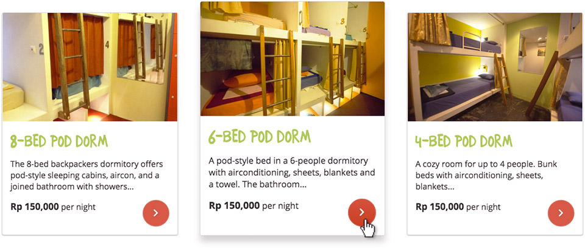
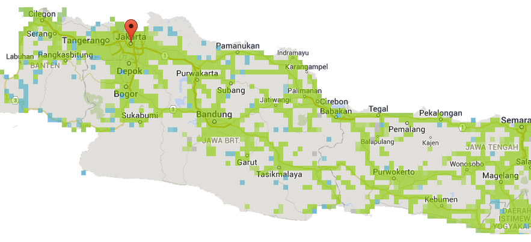
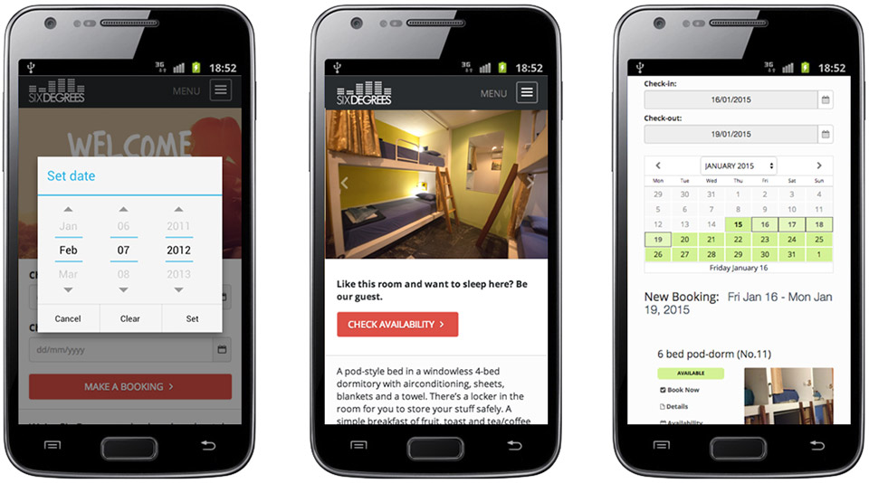

<figure class="extend">
  
</figure>

I met the owners of Six Degrees, a backpacker hostel in Jakarta, while travelling through Indonesia in late 2014. We had a couple of [Bintangs](http://en.wikipedia.org/wiki/Bintang_Beer) on a rooftop and started talking. They were planning on building a new branch of their hostel on Bali, and needed a complete overhaul of their web presence.

Back home, I took on the job from start to finish and developed a new website to drastically improve the previous user experience. The end result is a fully responsive, high performant, goal oriented site that increases bookings and is well prepared to meet the requirements of today's web.

## Concept &amp; Design

The guys had built their hostel themselves pretty much from scratch, and [they did an awesome job](https://www.tripadvisor.co.uk/Hotel_Review-g294229-d2416980-Reviews-Six_Degrees-Jakarta_Java.html) at it. The big difference to a conventional hotel was the character of the place; A cozy, colorful oasis in a buzzing city that made people feel immediately at home.

While working on the redesign, I kept that in mind. I wanted to create something that felt hand-made, not perfect, but with a lot of attention to detail. It should be honest, personal and fun.

<figure class="extend">
  
</figure>

One way to communicate this was the use of actual hand-written "love notes" they had received from past guests. There was an entire wall plastered with those in the lobby, so I had them scan a few and put them alongside the standard Tripadvisor &amp; Co reviews on the home page.

<figure class="extend">
  
  <figcaption>spreading the love</figcaption>
</figure>

The site was developed fully responsive and designed especially with touch interaction in mind. Parts of the layout are using "cards" as a method of displaying items, a concept borrowed from Google's [Material Design](http://www.google.com/design/spec/components/cards.html). The use of 3D animation and shadows not only makes for a strong visual metaphor, it also provides mobile users with a much bigger click target, as the whole "card" area can be tapped. Swipe gestures are also supported on image sliders and galleries.

<figure class="extend">
  
</figure>

## Mobile UX &amp; Performance

An important part of the project was the need for mobile optimization. A lot of traffic came from travellers who were already on the road, accessing the site from a variety of devices and network connections - so the new website was built mobile-first, with a very strong focus on compatibility and performance. Progressive enhancement was applied to make sure users with older devices were not singled out.

Now the overall 3G coverage in Indonesia is not as bad as you'd expect, In fact on my travels I managed to get a decent signal with a local SIM - even in more secluded areas - but connection speeds can get very slow once you move away from the main routes:

<figure class="extend">
  
  <figcaption>approximate 3G coverage on java, 2015</figcaption>
</figure>

I knew from personal experience the frustration of trying to book a room or flight from a desktop-only site where every page takes minutes to load, so performance was key with the new site. Responsive images, asynchronous loading techniques and clever caching were just a few parts of this effort.

The main objective was improving the booking process - users are able to select arrival dates, pick a room and finalize a reservation in one continued flow from start to finish. Wherever possible, native controls are used to help with data input, and clear feedback is provided at all stages.

<figure class="extend">
  
</figure>
