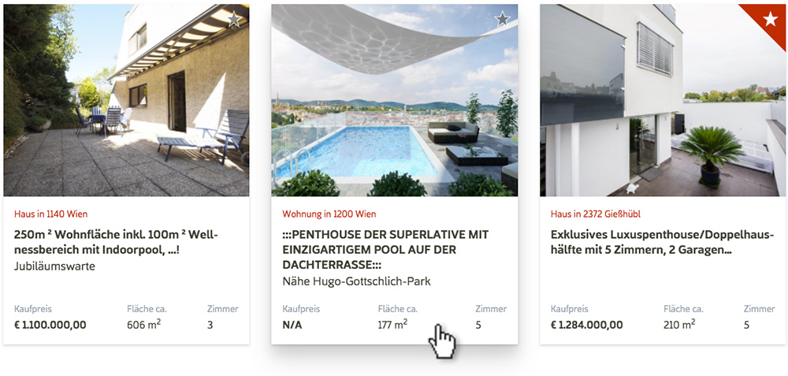

<figure class="extend">
  
</figure>

**TRI**STAR is a real estate business based in Vienna. They operate a network of professional real estate agents with decades of experience and provide first-class services to buyers and sellers. In 2016, right around the time I was looking for a new place myself, I helped them relaunch their website.

<figure class="extend">
  
</figure>

## Usability first

When you are searching for your new home, it can be hard to find exactly what you're looking for. So while developing the interface, we focused on usability and convenience before everything else. There's an extensive filter available to refine your search, and getting detailed information about an object is easy and straightforward.

It's also possible to save interesting objects on a personal watchlist, so users don't have to keep track of every place they like. If you don't find anything, you can also save a specific search request to get notified once new objects become available that match your criteria.

  <video poster="images/realty_filter.jpg" preload="" autoplay="autoplay" loop="loop" width="944" height="460" alt="Object Search Filter">
    <source src="video/searchrequest.webm" type="video/webm" />
    <source src="video/searchrequest.mp4" type="video/mp4" />
  </video>

## API Integration

The site integrates [Justimmo](http://justimmo.at/), a specialized API service that connects clients, agents and home owners with live data. 

Real estate listings, customer management, inquiries and more are all handled through one central platform. The website was custom made to work with this service, and extend it even further by offering search requests, user accounts, team profiles and a state-of-the art frontend across all devices.