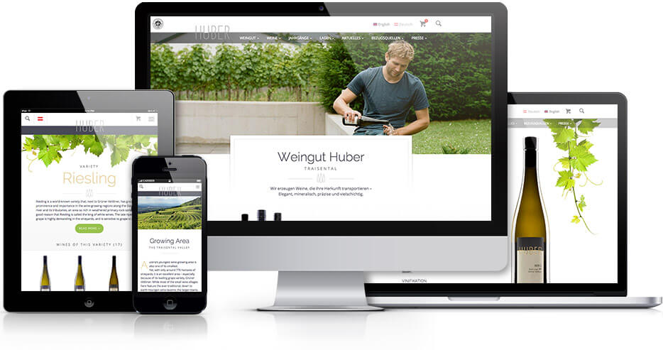
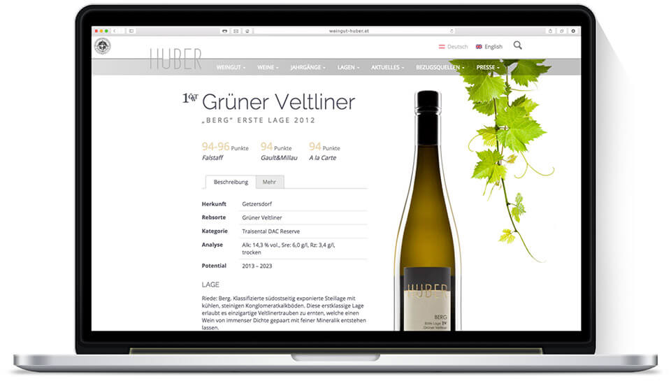
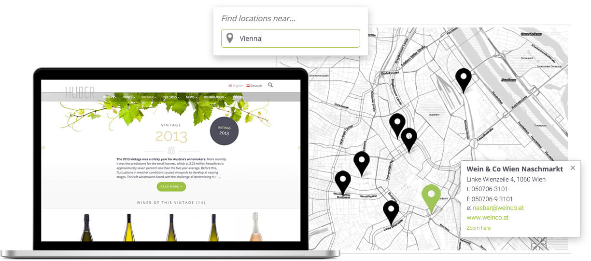

<figure class="extend">
  
</figure>

The Huber vineyards are located in Reichersdorf, Lower Austria – in the middle of the Traisental valley. This region has long been known for excellent winemaking, but Markus Huber still managed to rise to the top of his craft pretty quickly. National and international trade press have described him as a winemaker to watch and a ‘Wunderkind’ – and today Huber Wines are available in over 20 countries across the globe.

In 2015, their web presence had gathered some dust and was in need of a clean fresh start. We met to discuss the new requirements and strategy, and (after tasting their excellent Grüner Veltliner) I got to work.

## The Challenge

The project included a lot of tasks that had to be coordinated. The main objectives were:

* Re-structuring the content and user flow
* A complete redesign of the Huber brand
* Development of the new site and online shop
* Setup of a multilingual newsletter campaign for clients and distributors

<figure class="extend">
  
</figure>

## Web Development

Responsive, Performant, Multilingual; The new website needs to play a lot of parts. Among other stuff, it includes a full shop system, a geolocation storefinder, a blog, and a press & downloads section. Much of the content had to be scraped off the old site, re-organized and then imported back into the new database. 60+ products, 500 distributors and lots of other pages were migrated this way.

<figure class="extend">
  
</figure>

  <video poster="images/bottleslider-still.jpg" preload="" autoplay="autoplay" loop="loop" width="960" height="360">
    <source src="video/bottleslider.webm" type="video/webm" />
    <source src="video/bottleslider.mp4" type="video/mp4" />
  </video>

## Thinking ahead

The huber winery has clients and distributors all over the world, from small boutique wine shops to big corporate resellers. So naturally, there’s a lot of different use cases involved. Making sure all users find what they’re looking for required a good link structure, friendly UI and multiple rounds of testing.

<figure class="extend">
  
</figure>

A lot of ground work was done to support possible future extensions of the site. A complete WooCommerce shop was put in place, though deactivated at launch until all the logistics are ready. The shop system is made to sync with the vineyard’s stock keeping software, and allows for fully automated orders and delivery.

During the development of this project, Markus won the prestigious “Falstaff vintner of the year” award – cheers to that!